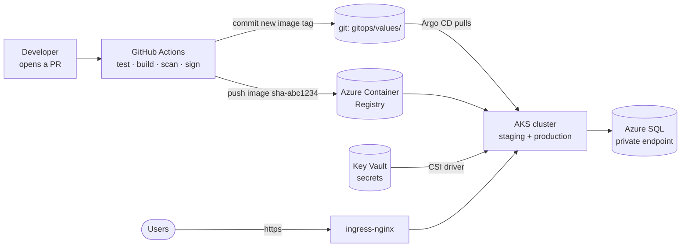

# Ironhack Final — Production-Shaped 3-Tier Platform on AKS

## What is this?

A complete, production-style platform on **Azure Kubernetes Service**, built by
team *the locals* as the Ironhack DevOps capstone. It runs a real 3-tier web
application — but the app is intentionally the least interesting part. The
graded deliverable is everything around it:

- **Infrastructure as Code** — one Terraform apply builds the entire cloud
  environment (cluster, registry, database, networking, monitoring).
- **Two independent CI/CD pipelines** — one for infrastructure, one per app,
  with security scanning, approval gates, and zero long-lived credentials.
- **GitOps deploys** — CI never touches the cluster; Argo CD inside the
  cluster pulls what git says should run.
- **Observability & security** — dashboards, alerts, network isolation,
  signed images, and secrets that never appear in git.

The demo app is **Overcast**, a cloud-bill waste scanner: upload an Azure or
AWS cost export (CSV) and it flags wasteful resources — unattached disks, idle
public IPs, oversized VMs — with estimated monthly savings and an optional
AI-written summary. It exists to prove the platform works end to end; the app
layer is a thin, swappable stub by design (see
[docs/architecture.md](docs/architecture.md)).

> **Setting it up?** [GUIDE.md](GUIDE.md) is the ordered, human checklist —
> every step from empty repo to graded demo. This README is the map; GUIDE.md
> is the route.

## The big picture



Read it left to right: a developer only ever pushes git commits. CI builds and
scans an image, pushes it to the registry, then **commits the new image tag
back to git**. Argo CD (running inside the cluster) notices the commit and
rolls out the change. Nothing and nobody deploys by hand — if it's not in git,
it doesn't run.

## What's in the repo

| Folder | What it is, in plain words |
| ------ | -------------------------- |
| [`apps/`](apps/) | The two application stubs: `frontend/` (React + Vite + TypeScript, served by unprivileged nginx) and `backend/` (Spring Boot 3 / Java 21, talks to the database). |
| [`infra/bootstrap/`](infra/bootstrap/) | **Phase 0** — the one script a human runs once with Owner rights. Creates the chicken-and-egg things CI can't create for itself: Terraform state storage, the resource group, and three OIDC identities for CI. |
| [`infra/terraform/`](infra/terraform/) | Everything else in Azure: AKS (two autoscaled node pools), ACR, Key Vault, Azure SQL behind a private endpoint, VNet, Log Analytics — plus the in-cluster platform (Argo CD, Kyverno, ingress-nginx, cert-manager, monitoring), all from one apply. |
| [`deploy/`](deploy/) | Helm charts for both apps: health probes, autoscaling (HPA), disruption budgets, pod spread, network policies, Key Vault secret mounting. |
| [`gitops/`](gitops/) | What Argo CD watches: per-environment image tags in `values/` (written by CI, never by hand) and Kyverno admission policies in `policies/`. **This folder is the deploy button.** |
| [`observability/`](observability/) | Prometheus + Grafana configuration: scrape targets, two dashboards, four alert rules. |
| [`security/`](security/) | Default-deny network policies, RBAC, the secret-mounting reference, and [SECURITY.md](security/SECURITY.md) — the index of every security control. |
| [`load-test/`](load-test/) | k6 script: 350 req/s sustained, p95 ≤ 300 ms, makes the autoscaler climb on camera. |
| [`.github/`](.github/workflows/) | Six workflows: infra plan / apply / nightly drift check, backend + frontend CI/CD, secret scanning. All authenticate via OIDC — the repo holds **no cloud credentials**. |
| [`docs/`](docs/) | Architecture (diagrams + every decision justified), operations runbook, and 9 numbered ADRs recording *why* each non-obvious choice was made. |

## How it operates: Phase 0 once, then pull requests forever

**Phase 0 (manual, once).** A human with subscription Owner runs
[`infra/bootstrap/bootstrap.sh`](infra/bootstrap/README.md). It creates only
what CI cannot create for itself: Terraform state storage, the app resource
group, and three GitHub-federated CI identities — read-only for plans,
read-write for applies (gated), and push-only for images. It prints ~9 IDs to
paste into GitHub repo variables. **No secrets are produced anywhere** — CI
proves its identity to Azure via OIDC tokens, minted per job, expiring in
minutes.

**Everything after is a pull request:**

- **Infrastructure change** → PR touching `infra/**` → the Terraform plan is
  posted as a PR comment + Trivy scans the IaC for misconfigurations → merge →
  a reviewer approves the `production`-gated apply → Terraform applies.
- **App change** → PR touching `apps/backend/**` or `apps/frontend/**`
  (each triggers only its own pipeline) → tests → image build → Trivy
  vulnerability gate (HIGH/CRITICAL fails the build) → merge to main → image
  pushed as immutable `sha-<gitsha>` and **cosign-signed** → CI commits the
  staging tag bump to `gitops/values/` → a reviewer approves → CI commits the
  production bump. Argo CD reconciles each bump; **CI never runs helm or
  kubectl** ([ADR-0008](docs/adr/0008-pull-based-gitops-argocd.md)).
- **Rollback** = `git revert` the tag-bump commit. Argo CD rolls the cluster
  back to match git.

Two safety nets run on their own: a **nightly drift check** (read-only plan;
opens a labeled issue if the cloud no longer matches Terraform) and **gitleaks**
secret scanning on every push and PR.

## Setup, condensed

Full detail with explanations lives in [GUIDE.md](GUIDE.md) — this is the
short version.

```bash
# 0. Prereqs: az CLI logged in as subscription Owner; this code in a GitHub repo.

# 1. Phase 0 (once):
cd infra/bootstrap
SUBSCRIPTION_ID=<sub-id> GITHUB_REPO=<org>/<repo> ./bootstrap.sh

# 2. GitHub config (once):
#    - Environments: create 'staging' and 'production'; required reviewer on 'production'
#    - Actions → Variables: paste the values the script printed
#    - Branch protection on main (allow the github-actions app to bypass —
#      the GitOps promote jobs commit tag bumps to main)

# 3. Provision: open any PR touching infra/, review the plan comment,
#    merge, approve the gated apply (~15–20 min the first time).
#    That single apply also installs Argo CD, Kyverno, ingress-nginx,
#    cert-manager, and the monitoring stack — no manual helm/kubectl steps.

# 4. Post-apply (once): set repo variable ACR_LOGIN_SERVER from terraform output.

# 5. Ship the apps: push any change under apps/backend/ or apps/frontend/ to main.
#    (The fresh registry is empty — the first CI run of each app populates it.)
```

Optional extras (each explained in GUIDE.md §5): the AI assistant (one repo
secret + two variables, delivered to the pod via Key Vault), TLS + DNS
hostnames, and Grafana/Argo CD login credentials.

**Local development needs none of the above:**

```bash
docker compose up --build     # frontend :8081, backend :8080, postgres
```

Local uses Postgres for convenience; production uses Azure SQL. The app can't
tell the difference — it only ever sees `SPRING_DATASOURCE_*` env vars.

## The demo: scalability + observability in one run

```bash
k6 run -e BASE_URL=https://<host> load-test/items-load.js
```

350 req/s sustained against `/api/items`, asserting p95 ≤ 300 ms, while the
Grafana **Platform** dashboard shows HPA replicas climbing 3 → max and back
down. Details: [load-test/README.md](load-test/README.md).

## Five ideas that explain most of the design

1. **No secrets, anywhere.** CI authenticates to Azure with short-lived OIDC
   tokens; pods reach Key Vault with workload identity; the database password
   is generated by Terraform and lands in the pod via a Key Vault CSI mount.
   Nothing to leak, nothing to rotate by hand ([ADR-0004](docs/adr/0004-oidc-identity-split.md)).
2. **Git is the only deploy path.** Argo CD self-heals (manual cluster edits
   are reverted) and prunes (deleted in git = deleted in cluster). What runs
   is always answerable by reading `gitops/values/` ([ADR-0008](docs/adr/0008-pull-based-gitops-argocd.md)).
3. **Images are immutable.** Deploys pin `sha-<gitsha>` tags only — a tag
   never changes meaning, so rollbacks are exact ([ADR-0005](docs/adr/0005-immutable-image-tags.md)).
   Kyverno rejects `:latest`, non-ACR registries, unsigned images, root
   containers, and pods without resource limits at admission time ([ADR-0009](docs/adr/0009-image-signing-admission-policies.md)).
4. **Environments are namespaces.** One cluster, `app-staging` and
   `app-production`, identical charts — only the values files differ. Default-deny
   network policies mean the backend is reachable only from the frontend,
   the ingress controller, and monitoring.
5. **Everything must survive a wipe.** The training subscription is deleted
   nightly, so nothing is ever installed by hand — one bootstrap run + one
   gated apply + two CI dispatches rebuild the entire platform from git
   (GUIDE.md "Morning kickstart").

## Rubric map

| Rubric line | Where it is satisfied |
| ----------- | --------------------- |
| **Architecture** — design & justification | [docs/architecture.md](docs/architecture.md) (mermaid + every decision with the rejected alternative), [docs/adr/](docs/adr/) 0001–0009 |
| **Infra automation** — IaC, no clicks | [infra/terraform/](infra/terraform/) (AKS system+user autoscaled pools, ACR, Key Vault, Azure SQL + private endpoint, VNet, Log Analytics, workload identity, in-cluster platform via [platform.tf](infra/terraform/platform.tf)), [infra/bootstrap/](infra/bootstrap/) for the documented run-once Phase 0 |
| **Infra CI/CD** — plan on PR, gated apply, policy checks | [.github/workflows/infra-plan.yml](.github/workflows/infra-plan.yml) (fmt, validate, Trivy IaC policy scan, plan-as-PR-comment), [.github/workflows/infra-apply.yml](.github/workflows/infra-apply.yml) (OIDC RO/RW split, `production` reviewer gate); state locking in [infra/bootstrap/README.md](infra/bootstrap/README.md), automated nightly drift detection in [.github/workflows/infra-drift.yml](.github/workflows/infra-drift.yml) + [docs/runbook.md](docs/runbook.md#infra-drift-detection) |
| **App CI/CD** — two independent path-filtered pipelines | [.github/workflows/backend-ci-cd.yml](.github/workflows/backend-ci-cd.yml), [.github/workflows/frontend-ci-cd.yml](.github/workflows/frontend-ci-cd.yml) (test → build → Trivy gate → sha-tag push + cosign sign → GitOps promote to staging → gated production promote) |
| **GitOps** — pull-based deploys, git as source of truth | [gitops/](gitops/), Argo CD installed by [infra/terraform/gitops.tf](infra/terraform/gitops.tf), [docs/adr/0008](docs/adr/0008-pull-based-gitops-argocd.md) (self-heal, prune, `git revert` rollback) |
| **Kubernetes quality** — probes, HPA, PDB, spread, resources | [deploy/backend/](deploy/backend/), [deploy/frontend/](deploy/frontend/) (helm lint + template clean) |
| **Security** — secrets, identity, network, supply chain | [security/SECURITY.md](security/SECURITY.md) (index of all controls), [security/networkpolicies.yaml](security/networkpolicies.yaml), [security/rbac.yaml](security/rbac.yaml), Key Vault CSI in [deploy/backend/templates/secretproviderclass.yaml](deploy/backend/templates/secretproviderclass.yaml), Trivy gates in both app workflows, cosign signing + Kyverno admission policies ([docs/adr/0009](docs/adr/0009-image-signing-admission-policies.md), [gitops/policies/](gitops/policies/)), gitleaks secret scan ([.github/workflows/secret-scan.yml](.github/workflows/secret-scan.yml)), Dependabot + SHA-pinned actions ([.github/dependabot.yml](.github/dependabot.yml)) |
| **Observability** — metrics, dashboards, alerts | [observability/](observability/) (kube-prometheus-stack values, ServiceMonitor → `/actuator/prometheus`, 2 Grafana dashboards, 4 Alertmanager rules), responses in [docs/runbook.md](docs/runbook.md) |
| **Scalability** — HPA + cluster autoscaler, proven | HPAs in both charts, autoscaled node pools in [infra/terraform/aks.tf](infra/terraform/aks.tf), demo in [load-test/](load-test/) |
| **Operations** — deploy, rollback, rotation, incidents | [docs/runbook.md](docs/runbook.md) |

## Swappability guarantee

The future product replaces `apps/` code while keeping the contract: port 8080,
actuator probe paths, an `/api/*` surface, `SPRING_DATASOURCE_*` env vars, and
the runtime `env.js` for the frontend's API URL. Pipelines rebuild, rescan, and
redeploy via `image.tag=sha-<gitsha>` — Terraform, Helm plumbing, workflows,
dashboards, and alerts are untouched. See the contract table in
[docs/architecture.md](docs/architecture.md#the-swappable-app-contract).
